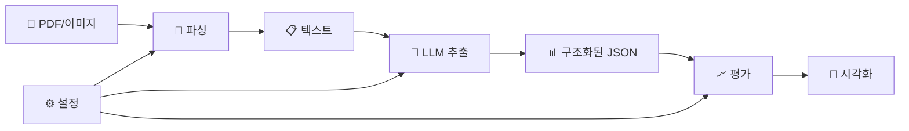

# 📊 Structured Output Kit

<div align="center">

**🚀 PDF/이미지 파싱 + LLM 구조화된 출력 추출 + 정량적 평가 + 시각화를 위한 통합 벤치마크 툴킷**

[](https://www.python.org/downloads/)
[](LICENSE)
[](https://fastapi.tiangolo.com)
[](https://streamlit.io)

</div>

다양한 파싱 프레임워크(Docling, PyPDF, PDFPlumber 등)로 문서를 텍스트화하고, 여러 LLM 호스트(OpenAI, Anthropic, Google, Ollama 등)와 추출 프레임워크(Instructor, LangChain, LlamaIndex, Marvin 등)를 통일된 인터페이스로 실험하여 구조화된 정보를 추출하고, 정답 JSON과의 유사도를 정량화하여 시각화할 수 있는 종합 벤치마크 도구입니다.

## ✨ 주요 특징

� **다중 파싱 프레임워크**  
- PDF: Docling, PyPDF, PDFPlumber, PyMuPDF 지원
- 이미지: Vision Language Model(VLM) 기반 OCR
- Microsoft: MarkItDown으로 다양한 문서 형식 지원

🔄 **다중 LLM 호스트 & 프레임워크**  
- **호스트**: OpenAI, Anthropic, Google, Ollama, OpenAI-Compatible 서버
- **프레임워크**: Instructor, LangChain(Tool/Parser), LlamaIndex, Marvin, Mirascope, Ollama 등

🎯 **정량적 평가 시스템**  
- 임베딩 유사도(코사인 유사성)와 완전일치 기반 하이브리드 스코어링
- 필드별 세부 평가 및 헝가리안 알고리즘을 통한 최적 매칭

📊 **실시간 시각화**  
- Streamlit 기반 인터랙티브 대시보드
- 정적 HTML 리포트 생성
- 성능 분포 및 필드별 상세 분석

🚀 **API & CLI 통합 인터페이스**  
- RESTful API 서버 (FastAPI)
- Typer 기반 명령줄 인터페이스
- 파싱 → 추출 → 평가 → 시각화 전체 파이프라인 지원

🔧 **확장성 & 커스터마이징**  
- 커스텀 스키마 추가 (Pydantic 기반)
- 평가 기준 커스터마이징 (YAML 설정)
- 새로운 프레임워크 쉽게 추가 가능

## 🚀 Quick Start

### 1️⃣ 설치

```bash
# uv 설치 (권장)
curl -fsSL https://astral.sh/uv/install.sh | sh

# 프로젝트 클론 및 의존성 설치
git clone https://github.com/Bae-ChangHyun/StructuredOutputKit.git
cd StructuredOutputKit
uv venv
source .venv/bin/activate
uv sync
```

### 2️⃣ 환경 설정

```bash
# 환경 변수 파일 생성
cp .env.example .env

# .env 파일에 API 키 설정
echo "OPENAI_API_KEY=your_api_key_here" >> .env
```

### 3️⃣ 30초 테스트

```bash
# API 서버 시작
python main.py

# 새 터미널에서 텍스트 추출 테스트
curl -X POST http://localhost:8000/v1/extraction \
  -H 'Content-Type: application/json' \
  -d '{
    "input_text": "안녕하세요. 저는 홍길동입니다. 컴퓨터공학과를 졸업했고 Python 개발자로 3년간 근무했습니다.",
    "schema_name": "schema_han",
    "framework": "OpenAIFramework",
    "host_info": {
      "provider": "openai",
      "base_url": "https://api.openai.com/v1",
      "model": "gpt-4o-mini"
    }
  }'
```

### 4️⃣ CLI로 시작하기

```bash
# 텍스트에서 구조화된 정보 추출
python main.py --cli extract --input "안녕하세요. 김철수입니다. 서울대학교 졸업 후 삼성에서 5년간 근무했습니다."

# PDF 파일 파싱 (예시)
python main.py --cli parse --file document.pdf --framework DoclingFramework

# 평가 실행 (샘플 데이터 사용)
python main.py --cli eval \
  --pred result/extraction/$(ls result/extraction | tail -1)/result.json \
  --gt data/리멤버-s1.json

# 시각화 실행
python main.py --cli viz --eval-result result/evaluation/$(ls result/evaluation | tail -1)/eval_result.json
```

## 📋 목차

<details>
<summary>📋 목차</summary>

- [설치 가이드](#-설치-가이드)
- [환경 설정](#-환경-설정)
- [사용법](#-사용법)
  - [API 사용법](#api-사용법)
  - [CLI 사용법](#cli-사용법)
- [프로젝트 구조](#-프로젝트-구조)
- [지원 프레임워크](#-지원-프레임워크)
- [파싱 시스템](#-파싱-시스템)
- [스키마와 평가](#-스키마와-평가)
- [시각화](#-시각화)
- [개발 가이드](#-개발-가이드)
- [성능 벤치마크](#-성능-벤치마크)
- [트러블슈팅](#-트러블슈팅)
- [라이선스](#-라이선스)

</details>

## 📦 설치 가이드

### 시스템 요구사항
- Python 3.12 이상
- Linux/macOS/Windows
- 최소 4GB RAM (VLM 사용 시 8GB+ 권장)

### 설치 방법

<details>
<summary><b>방법 1: uv 사용 (권장)</b></summary>

```bash
# uv 설치
curl -fsSL https://astral.sh/uv/install.sh | sh

# 프로젝트 설정
git clone https://github.com/Bae-ChangHyun/StructuredOutputKit.git
cd StructuredOutputKit
uv venv
source .venv/bin/activate  # Windows: .venv\Scripts\activate
uv sync
```

</details>

<details>
<summary><b>방법 2: pip 사용</b></summary>

```bash
git clone https://github.com/Bae-ChangHyun/StructuredOutputKit.git
cd StructuredOutputKit
python -m venv .venv
source .venv/bin/activate  # Windows: .venv\Scripts\activate
pip install -e .
```

</details>

<details>
<summary><b>방법 3: Docker (실험적)</b></summary>

```dockerfile
FROM python:3.12-slim
WORKDIR /app
COPY pyproject.toml uv.lock ./
RUN pip install uv && uv sync --no-dev
COPY . .
ENV API_HOST=0.0.0.0 API_PORT=8000
EXPOSE 8000
CMD ["python", "main.py"]
```

```bash
docker build -t structured-output-kit .
docker run -p 8000:8000 --env-file .env structured-output-kit
```

</details>

## ⚙️ 환경 설정

### 환경 변수 설정

`.env.example`을 복사하여 `.env` 파일을 생성하고 필요한 API 키를 설정하세요.

<details>
<summary><b>환경 변수 상세 설정</b></summary>

```ini
# 서버 설정
API_HOST=0.0.0.0
API_PORT=8000
DEBUG=true

# OpenAI
OPENAI_API_KEY=sk-your-api-key
OPENAI_MODELS=gpt-4o-mini
OPENAI_EMBED_MODELS=text-embedding-3-small

# Anthropic
ANTHROPIC_API_KEY=your-api-key
ANTHROPIC_MODELS=claude-3-5-sonnet-latest

# Google
GOOGLE_API_KEY=your-api-key
GOOGLE_MODELS=gemini-1.5-flash

# OpenAI-Compatible (vLLM, Together AI 등)
OPENAI_COMPATIBLE_BASEURL=http://localhost:8000/v1
OPENAI_COMPATIBLE_MODELS=your-model-name
OPENAI_COMPATIBLE_API_KEY=dummy

# Ollama
OLLAMA_BASEURL=http://localhost:11434/v1
OLLAMA_MODELS=llama3.1:8b

# HuggingFace (로컬 임베딩)
HUGGINGFACE_EMBED_MODELS=jhgan/ko-sroberta-multitask

# Langfuse (선택사항)
LANGFUSE_HOST=your-langfuse-host
LANGFUSE_PUBLIC_KEY=your-public-key
LANGFUSE_SECRET_KEY=your-secret-key

# 제한 설정
MAX_FILE_SIZE=10485760
TASK_TIMEOUT=3600
```

</details>

## 💻 사용법

### API 사용법

#### 서버 시작

```bash
# 기본 실행
python main.py

# 커스텀 포트로 실행
python main.py --port 8080

# 개발 모드 (자동 리로드)
python main.py --reload
```

API 문서: http://localhost:8000/docs

#### 주요 엔드포인트

<details>
<summary><b>� 파싱 API - POST /v1/parsing</b></summary>

**PDF/이미지 파일 파싱:**
```bash
curl -X POST http://localhost:8000/v1/parsing \
  -F 'file=@document.pdf' \
  -F 'framework=DoclingFramework'
```

**Python 사용법:**
```python
import requests

with open("document.pdf", "rb") as f:
    response = requests.post(
        "http://localhost:8000/v1/parsing",
        files={"file": f},
        data={
            "framework": "DoclingFramework",
            "extra_kwargs": '{"parse_figures": true}'
        }
    )

result = response.json()
print(f"파싱된 텍스트: {result['data']['content']}")
print(f"파싱 시간: {result['latency']}초")
```

</details>

<details>
<summary><b>�🔄 추출 API - POST /v1/extraction</b></summary>

**기본 사용법:**
```bash
curl -X POST http://localhost:8000/v1/extraction \
  -H 'Content-Type: application/json' \
  -d '{
    "input_text": "안녕하세요. 제 이름은 홍길동입니다.",
    "schema_name": "schema_han",
    "framework": "OpenAIFramework",
    "host_info": {
      "provider": "openai",
      "base_url": "https://api.openai.com/v1",
      "model": "gpt-4o-mini"
    }
  }'
```

**Python 사용법:**
```python
import requests

response = requests.post("http://localhost:8000/v1/extraction", json={
    "input_text": "김철수입니다. 서울대학교 컴퓨터공학과 졸업 후 네이버에서 5년간 근무했습니다.",
    "schema_name": "schema_han",
    "framework": "OpenAIFramework",
    "extra_kwargs": {"temperature": 0.1, "timeout": 900},
    "host_info": {
        "provider": "openai",
        "base_url": "https://api.openai.com/v1", 
        "model": "gpt-4o-mini"
    }
})

result = response.json()
print(f"추출 결과: {result['data']['result']}")
print(f"성공률: {result['success_rate']}")
print(f"응답 시간: {result['latency']}초")
```

</details>

<details>
<summary><b>📊 평가 API - POST /v1/evaluation</b></summary>

```bash
curl -X POST http://localhost:8000/v1/evaluation \
  -H 'Content-Type: application/json' \
  -d '{
    "pred_json_path": "result/extraction/20250812_0850/result.json",
    "gt_json_path": "data/리멤버-s1.json",
    "schema_name": "schema_han",
    "host_info": {
      "provider": "huggingface",
      "base_url": "",
      "model": "jhgan/ko-sroberta-multitask"
    }
  }'
```

</details>

<details>
<summary><b>🎨 시각화 API - POST /v1/visualization/generate</b></summary>

```bash
curl -X POST http://localhost:8000/v1/visualization/generate \
  -H 'Content-Type: application/json' \
  -d '{
    "eval_result_path": "result/evaluation/20250812_0854/eval_result.json"
  }'
```

</details>

<details>
<summary><b>🔧 유틸리티 API</b></summary>

```bash
# 지원 호스트 목록
curl http://localhost:8000/v1/utils/providers

# 호스트별 프레임워크 목록  
curl http://localhost:8000/v1/utils/frameworks?provider=openai

# 사용 가능한 스키마 목록
curl http://localhost:8000/v1/utils/schemas

# 파싱 프레임워크 목록
curl http://localhost:8000/v1/utils/parsing-frameworks
```

</details>

### CLI 사용법

#### 파싱 (Parsing)

```bash
# PDF 파일 파싱
python main.py --cli parse --file document.pdf --framework DoclingFramework

# 이미지 OCR (VLM 사용)
python main.py --cli parse --file image.png --framework VLMFramework

# 고급 옵션
python main.py --cli parse \
  --file document.pdf \
  --framework PDFPlumberFramework \
  --kwargs '{"parse_tables":true}' \
  --save
```

#### 추출 (Extract)

```bash
# 기본 추출
python main.py --cli extract --input "홍길동입니다. 서울대 졸업 후 카카오에서 3년 근무했습니다."

# 파일에서 추출
python main.py --cli extract --input ./sample.txt --schema schema_han

# 고급 옵션
python main.py --cli extract \
  --input "텍스트 내용" \
  --schema schema_han \
  --retries 3 \
  --kwargs '{"temperature":0.1,"timeout":900}' \
  --save
```

#### 평가 (Evaluation)

```bash
# 기본 평가
python main.py --cli eval \
  --pred result/extraction/latest/result.json \
  --gt data/리멤버-s1.json

# 커스텀 평가 기준 사용
python main.py --cli eval \
  --pred result/extraction/latest/result.json \
  --gt data/리멤버-s1.json \
  --criteria evaluation/criteria/custom_criteria.json \
  --save
```

#### 시각화 (Visualization)

```bash
# Streamlit 대시보드 실행
python main.py --cli viz --eval-result result/evaluation/latest/eval_result.json

# 정적 HTML 생성
python main.py --cli viz \
  --eval-result result/evaluation/latest/eval_result.json \
  --html \
  --out result/visualization/custom_dir
```

## 🏗️ 프로젝트 구조

<details>
<summary><b>📁 전체 프로젝트 구조</b></summary>

```
structured_output_kit/
├── 📁 main.py                    # 🚀 메인 진입점 (API 서버/CLI 실행)
├── 📁 cli.py                     # 💻 Typer 기반 CLI 인터페이스
├── 📁 server/                    # 🌐 FastAPI 서버
│   ├── main.py                   # FastAPI 앱 설정 및 라우터 등록
│   ├── config.py                 # 서버 설정 관리
│   ├── routers/                  # API 엔드포인트
│   │   ├── extraction.py         # 구조화 정보 추출 API
│   │   ├── evaluation.py         # 평가 API
│   │   ├── parsing.py            # 파싱 API
│   │   ├── visualization.py      # 시각화 API
│   │   └── utils.py              # 유틸리티 API
│   ├── models/                   # 데이터 모델
│   └── services/                 # 비즈니스 로직 서비스
├── 📁 parsing/                   # 📄 파싱 모듈
│   ├── core.py                   # 파싱 핵심 로직
│   ├── factory.py                # 파싱 프레임워크 팩토리
│   ├── utils.py                  # 파싱 유틸리티
│   └── frameworks/               # 파싱 프레임워크 구현체
│       ├── docling_framework.py  # IBM Docling (권장)
│       ├── pypdf_framework.py    # PyPDF
│       ├── pdfplumber_framework.py # PDFPlumber
│       ├── fitz_framework.py     # PyMuPDF
│       ├── markitdown_framework.py # Microsoft MarkItDown
│       └── vlm_framework.py      # Vision Language Model
├── 📁 extraction/                # 🔧 추출 모듈
│   ├── core.py                   # 추출 핵심 로직
│   ├── utils.py                  # 추출 유틸리티
│   ├── factory.py                # LLM 프레임워크 팩토리
│   ├── compatibility.yaml        # 프레임워크-호스트 호환성 매핑
│   ├── frameworks/               # LLM 프레임워크 구현체
│   │   ├── openai_framework.py   # OpenAI 네이티브
│   │   ├── anthropic_framework.py # Anthropic 네이티브
│   │   ├── google_framework.py   # Google Gemini 네이티브
│   │   ├── ollama_framework.py   # Ollama 네이티브
│   │   ├── instructor_framework.py # Instructor
│   │   ├── langchain_tool_framework.py # LangChain Tool
│   │   ├── langchain_parser_framework.py # LangChain Parser
│   │   ├── llamaindex_framework.py # LlamaIndex
│   │   ├── marvin_framework.py   # Marvin
│   │   └── mirascope_framework.py # Mirascope
│   └── schema/                   # 데이터 스키마
│       └── schema_han.py         # 한국어 이력서 스키마
├── 📁 evaluation/                # 📊 평가 모듈  
│   ├── core.py                   # 평가 핵심 로직
│   ├── metrics.py                # 평가 메트릭 (임베딩 유사도, 완전일치)
│   ├── utils.py                  # 평가 유틸리티
│   ├── visualizer.py             # Streamlit 시각화
│   └── criteria/                 # 평가 기준 설정 파일
├── 📁 utils/                     # 🛠️ 공통 유틸리티
│   ├── types.py                  # 타입 정의 (Request/Response 모델)
│   ├── logging.py                # 로깅 설정
│   ├── tracing.py                # Langfuse 추적 설정
│   ├── cli_helpers.py            # CLI 헬퍼 함수
│   ├── common.py                 # 공통 기능
│   └── visualization.py          # 시각화 헬퍼
├── 📁 data/                      # 📄 샘플 데이터
│   ├── 리멤버-s1.json            # 한국어 이력서 샘플
│   ├── 국문이력서(그림포함)-s1.json
│   └── ...
└── 📁 result/                    # 📈 결과 저장소
    ├── parsing/                  # 파싱 결과
    ├── extraction/               # 추출 결과
    ├── evaluation/               # 평가 결과
    └── visualization/            # 시각화 결과
```

</details>

### 실행 모드

- **🌐 API 서버 모드**: `python main.py` (기본값)
- **💻 CLI 모드**: `python main.py --cli [command]`

### 파이프라인 플로우



## 🔧 지원 프레임워크

### 파싱 프레임워크

<details>
<summary><b>📄 PDF 파싱 프레임워크</b></summary>

| 프레임워크 | 특징 | 용도 |
|-----------|------|------|
| **DoclingFramework** | IBM 개발, 최신 AI 기반 | 복잡한 레이아웃, 테이블 추출 (권장) |
| **PDFPlumberFramework** | 테이블 추출 특화 | 정확한 테이블 데이터 필요 시 |
| **PyPDFFramework** | 빠르고 가벼움 | 단순한 텍스트 추출 |
| **FitzFramework** | PyMuPDF 기반 | 고성능, 다양한 포맷 지원 |
| **MarkItDownFramework** | Microsoft 개발 | Office 문서, 다양한 형식 지원 |

</details>

<details>
<summary><b>🖼️ 이미지/OCR 프레임워크</b></summary>

| 프레임워크 | 모델 지원 | 특징 |
|-----------|-----------|------|
| **VLMFramework** | OpenAI GPT-4V, Google Gemini | 멀티모달 OCR, 이해력 높음 |

</details>

### LLM 호스트별 지원 프레임워크

<details>
<summary><b>🤖 OpenAI</b></summary>

- ✅ **OpenAIFramework** - 네이티브 Structured Outputs
- ✅ **InstructorFramework** - 타입 안전성 강화  
- ✅ **LangchainToolFramework** - Tool 기반 추출
- ✅ **LangchainParserFramework** - 파서 기반 추출
- ✅ **LlamaIndexFramework** - 데이터 중심 추출
- ✅ **MarvinFramework** - AI 엔지니어링 도구
- ✅ **MirascopeFramework** - 현대적 LLM 라이브러리

</details>

<details>
<summary><b>🎭 Anthropic</b></summary>

- ✅ **AnthropicFramework** - 네이티브 Tool Use
- ✅ **InstructorFramework** - Anthropic 지원
- ✅ **LangchainToolFramework** - Claude 통합  
- ✅ **LangchainParserFramework** - Claude 파서
- ✅ **MarvinFramework** - Claude 지원

</details>

<details>
<summary><b>🔍 Google</b></summary>

- ✅ **GoogleFramework** - Gemini 네이티브 JSON 모드
- ✅ **InstructorFramework** - Gemini 지원
- ✅ **LangchainToolFramework** - Gemini 통합
- ✅ **LangchainParserFramework** - Gemini 파서
- ✅ **LlamaIndexFramework** - Gemini 지원
- ✅ **MarvinFramework** - Gemini 지원
- ✅ **MirascopeFramework** - Gemini 지원

</details>

<details>
<summary><b>🦙 Ollama (로컬)</b></summary>

- ✅ **OllamaFramework** - 네이티브 JSON 구조화
- ✅ **OpenAIFramework** - OpenAI 호환 모드
- ✅ **InstructorFramework** - 로컬 모델 지원
- ✅ **LangchainToolFramework** - Ollama 통합
- ✅ **LangchainParserFramework** - Ollama 파서
- ✅ **LlamaIndexFramework** - Ollama 지원
- ✅ **MarvinFramework** - Ollama 지원
- ✅ **MirascopeFramework** - Ollama 지원

</details>

<details>
<summary><b>🔗 OpenAI-Compatible</b></summary>

vLLM, Together AI, Groq 등 OpenAI 호환 서버 지원

- ✅ **OpenAIFramework** - 호환 모드
- ✅ **InstructorFramework** - 호환 지원
- ✅ **LangchainToolFramework** - 호환 통합
- ✅ **LangchainParserFramework** - 호환 파서
- ✅ **LlamaIndexFramework** - 호환 지원
- ✅ **MarvinFramework** - 호환 지원
- ✅ **MirascopeFramework** - 호환 지원

</details>

## 📄 파싱 시스템

### 지원 파일 형식

<details>
<summary><b>📋 지원 파일 형식 목록</b></summary>

| 형식 | 확장자 | 추천 프레임워크 | 특징 |
|------|--------|-----------------|------|
| **PDF** | `.pdf` | DoclingFramework | 레이아웃, 테이블 보존 |
| **이미지** | `.png`, `.jpg`, `.jpeg` | VLMFramework | OCR + 이해 |
| **Word** | `.docx` | MarkItDownFramework | Office 문서 |
| **PowerPoint** | `.pptx` | MarkItDownFramework | 슬라이드 텍스트 |
| **Excel** | `.xlsx` | MarkItDownFramework | 스프레드시트 |

</details>

### 파싱 예시

```bash
# 복잡한 PDF 문서 (테이블 포함)
python main.py --cli parse --file report.pdf --framework DoclingFramework

# 이미지 기반 문서 (OCR)
python main.py --cli parse --file scan.png --framework VLMFramework

# Office 문서
python main.py --cli parse --file document.docx --framework MarkItDownFramework
```

## 📋 스키마와 평가

### 기본 스키마 (schema_han)

한국어 이력서 정보 추출을 위한 포괄적인 구조화된 스키마를 제공합니다.

<details>
<summary><b>📝 스키마 구조 상세</b></summary>

```python
class ExtractInfo(BaseModel):
    # 기본 정보
    personal_info: Optional[PersonalInfo]           # 개인정보 (이름, 연락처, 주소 등)
    summary_info: Optional[SummaryInfo]             # 요약정보 (간략소개, 핵심역량)
    
    # 학력 및 교육
    educations: List[Education]                     # 학력사항 (학교, 전공, 학점 등)
    education_programs: List[EducationProgram]      # 교육과정 (외부 교육, 연수 등)
    overseas_experiences: List[OverseasExperience]  # 해외연수 (국가, 기간, 내용)
    
    # 경력 및 성과
    careers: List[Career]                           # 경력사항 (회사, 직무, 담당업무 등)
    certificates: List[Certificate]                 # 자격증 (자격명, 발행처, 점수 등)
    awards: List[Award]                             # 수상/공모전 (수상명, 기관, 일자)
    
    # 기타 정보
    employment_preference: Optional[EmploymentPreference] # 취업우대 (보훈, 장애 등)
    military_service: Optional[MilitaryService]     # 병역 (군별, 계급, 기간)
    cover_letter: Optional[CoverLetter]             # 자기소개서
    etc_info: Optional[EtcInfo]                     # 기타 정보
```

**주요 필드 예시:**
- **PersonalInfo**: 이름, 성별, 생년월일, 연락처, 이메일, 주소, SNS 링크
- **Career**: 회사명, 입사/퇴사일, 담당업무, 연봉, 직책, 직급, 고용형태
- **Education**: 학교종류, 학교명, 전공, 학위, 학점, 졸업상태

</details>

### 평가 시스템

**하이브리드 평가 방식**을 사용하여 정확도와 의미적 유사성을 모두 측정합니다.

<details>
<summary><b>📊 평가 메트릭 상세</b></summary>

#### 1. 완전일치 (Exact Match)
- 문자열이 정확히 일치하는지 확인
- 이름, 이메일, 날짜 등 정확성이 중요한 필드에 사용

#### 2. 임베딩 유사도 (Embedding Similarity) 
- 코사인 유사도를 통한 의미적 유사성 측정
- 자기소개서, 담당업무 등 텍스트 필드에 사용
- 지원 모델: OpenAI, HuggingFace (ko-sroberta-multitask)

#### 3. 하이브리드 스코어
- 완전일치와 임베딩 유사도의 가중 평균
- 필드별 맞춤 가중치 설정 가능

#### 4. 헝가리안 알고리즘
- 리스트 요소 간 최적 매칭
- 경력, 학력 등 순서가 다를 수 있는 배열 데이터 평가

```python
# 필드별 평가 방식 예시
evaluation_criteria = {
    "personal_info.name": {"method": "exact"},        # 이름은 정확해야 함
    "personal_info.email": {"method": "exact"},       # 이메일도 정확해야 함  
    "summary_info.brief_introduction": {"method": "embedding"}, # 소개글은 의미적 유사성
    "careers": {"method": "hybrid", "exact_weight": 0.3, "embedding_weight": 0.7}
}
```

</details>

## 🎨 시각화

### Streamlit 대시보드

인터랙티브 대시보드로 평가 결과를 실시간으로 탐색할 수 있습니다.

<details>
<summary><b>📊 대시보드 기능</b></summary>

**주요 기능:**
- 📊 **전체 성능 개요**: 총점, 완전일치율, 임베딩 유사도
- 📈 **필드별 상세 분석**: 각 필드의 점수 분포 및 상세 비교
- 🔍 **예측 vs 정답 비교**: 실제 값과 예측 값의 시각적 비교
- 📉 **성능 분포 차트**: 점수 히스토그램 및 분포 시각화
- 🎯 **오류 분석**: 낮은 점수를 받은 필드의 원인 분석

**실행 방법:**
```bash
python main.py --cli viz --eval-result path/to/eval_result.json
```

</details>

### 정적 HTML 리포트

간단한 HTML 리포트로 결과를 공유할 수 있습니다.

**생성 방법:**
```bash
# CLI로 생성
python main.py --cli viz --eval-result path/to/eval_result.json --html

# API로 생성  
curl -X POST http://localhost:8000/v1/visualization/generate \
  -H 'Content-Type: application/json' \
  -d '{"eval_result_path": "path/to/eval_result.json"}'
```

## 🛠️ 개발 가이드

### 로컬 개발 환경

```bash
# 개발 모드로 서버 실행
python main.py --reload

# 테스트 실행 (구현 예정)
pytest tests/

# 코드 포맷팅 (권장)
black .
ruff check .
```

### 커스텀 스키마 추가

<details>
<summary><b>📝 새로운 스키마 생성 가이드</b></summary>

1. `extraction/schema/` 디렉토리에 새 스키마 파일 생성
2. Pydantic v2 BaseModel을 상속받는 `ExtractInfo` 클래스 정의
3. 스키마 이름으로 파일에 접근 가능

```python
# extraction/schema/custom_schema.py
from pydantic import BaseModel, Field
from typing import Optional, List

class PersonInfo(BaseModel):
    name: Optional[str] = Field(description="이름", default=None)
    age: Optional[int] = Field(description="나이", default=None)

class SkillInfo(BaseModel):
    skill_name: Optional[str] = Field(description="기술명", default=None)
    proficiency: Optional[str] = Field(description="숙련도", default=None)

class ExtractInfo(BaseModel):
    person: Optional[PersonInfo] = Field(description="인물정보", default=None)
    skills: List[SkillInfo] = Field(description="기술스택", default_factory=list)
```

</details>

### 커스텀 파싱 프레임워크 추가

<details>
<summary><b>🔧 새로운 파싱 프레임워크 구현</b></summary>

1. `parsing/frameworks/` 디렉토리에 새 프레임워크 파일 생성
2. `BaseFramework`를 상속받는 클래스 구현

```python
# parsing/frameworks/custom_framework.py
from structured_output_kit.parsing.base import BaseFramework

class CustomFramework(BaseFramework):
    def __init__(self, *args, **kwargs):
        super().__init__(*args, **kwargs)
        # 초기화 로직
    
    def run(self, retries: int = 1) -> tuple[str, bool, float]:
        # 파싱 로직 구현
        try:
            content = self.parse_file(self.file_path)
            return content, True, 0.5  # content, success, latency
        except Exception as e:
            return f"ERROR: {str(e)}", False, 0
    
    def parse_file(self, file_path: str) -> str:
        # 실제 파싱 로직
        pass
```

</details>

### 커스텀 LLM 프레임워크 추가

<details>
<summary><b>🤖 새로운 LLM 프레임워크 구현</b></summary>

1. `extraction/frameworks/` 디렉토리에 새 프레임워크 파일 생성
2. `BaseFramework`를 상속받는 클래스 구현
3. `compatibility.yaml`에 호스트 호환성 정보 추가

```python
# extraction/frameworks/custom_framework.py
from structured_output_kit.extraction.base import BaseFramework, experiment

class CustomFramework(BaseFramework):
    def __init__(self, *args, **kwargs):
        super().__init__(*args, **kwargs)
        # LLM 클라이언트 초기화
    
    def run(self, retries: int, inputs: dict = {}) -> tuple[list[Any], float, list[float]]:
        @experiment(retries=retries)
        def run_experiment(inputs):
            # LLM 호출 로직
            response = self.client.complete(
                prompt=self.prompt.format(**inputs),
                response_model=self.response_model
            )
            return response
        
        predictions, percent_successful, latencies = run_experiment(inputs)
        return predictions, percent_successful, latencies
```

</details>

### 기여 방법

1. 🍴 Fork the repository
2. 🌟 Create a feature branch: `git checkout -b feature/amazing-feature`
3. 💾 Commit your changes: `git commit -m 'Add amazing feature'`
4. 📤 Push to the branch: `git push origin feature/amazing-feature`
5. 🎯 Open a Pull Request

## � 성능 벤치마크

<details>
<summary><b>🚨 자주 발생하는 문제들</b></summary>

**🔌 포트 충돌**
```bash
# 다른 포트 사용
python main.py --port 8080
```

**🔑 API 키 오류**
```bash
# .env 파일 확인
cat .env | grep API_KEY

# 환경 변수 직접 설정
export OPENAI_API_KEY=your-key-here
```

**📦 의존성 문제**
```bash
# 가상환경 재생성
rm -rf .venv
uv venv
source .venv/bin/activate
uv sync
```

**🐌 느린 첫 실행**
- HuggingFace 모델 다운로드로 인한 지연
- 네트워크 연결 상태 확인

**💾 대용량 파일 처리**
```bash
# MAX_FILE_SIZE 조정 (.env)
MAX_FILE_SIZE=52428800  # 50MB
```

</details>

## 🔄 결과물 구조

```
result/
├── 📁 extraction/                # 추출 결과
│   └── 20250823_1430/           # 타임스탬프 폴더
│       ├── result.json          # 추출된 JSON 결과
│       ├── extraction.log       # 추출 로그
│       └── metadata.json        # 실행 메타데이터
├── 📁 evaluation/               # 평가 결과  
│   └── 20250823_1435/
│       ├── eval_result.json     # 평가 결과
│       ├── pred.json           # 예측 JSON (정규화됨)
│       ├── gt.json             # 정답 JSON
│       ├── criteria.json       # 사용된 평가 기준
│       └── evaluation.log      # 평가 로그
└── 📁 visualization/            # 시각화 결과
    └── 20250823_1440/
        └── visualization.html   # HTML 리포트
```

## 📈 성능 벤치마크

<details>
<summary><b>📊 샘플 벤치마크 결과</b></summary>

### LLM 프레임워크 성능 비교 (한국어 이력서 데이터셋)

| 프레임워크 | 호스트 | 모델 | 정확도 | 응답시간 | 안정성 | 특징 |
|-----------|-------|------|--------|----------|--------|------|
| **OpenAIFramework** | OpenAI | gpt-4o-mini | 94.2% | 1.2s | ⭐⭐⭐⭐⭐ | 네이티브 Structured Outputs |
| **AnthropicFramework** | Anthropic | claude-3-5-sonnet | 95.1% | 2.1s | ⭐⭐⭐⭐⭐ | Tool Use 기반 |
| **GoogleFramework** | Google | gemini-1.5-flash | 92.8% | 1.8s | ⭐⭐⭐⭐ | JSON 모드 |
| **InstructorFramework** | OpenAI | gpt-4o-mini | 93.8% | 1.4s | ⭐⭐⭐⭐⭐ | 타입 검증 강화 |
| **LangchainToolFramework** | OpenAI | gpt-4o-mini | 92.5% | 1.8s | ⭐⭐⭐⭐ | Tool 기반 |
| **OllamaFramework** | Ollama | llama3.1:8b | 88.3% | 3.2s | ⭐⭐⭐ | 로컬 실행 |

### 파싱 프레임워크 성능 비교

| 프레임워크 | 파일 형식 | 정확도 | 속도 | 특징 |
|-----------|-----------|--------|------|------|
| **DoclingFramework** | PDF | 95.2% | 중간 | 테이블, 레이아웃 보존 |
| **PDFPlumberFramework** | PDF | 91.8% | 빠름 | 테이블 추출 특화 |
| **VLMFramework** | 이미지 | 89.7% | 느림 | OCR + 이해력 |
| **PyPDFFramework** | PDF | 87.3% | 매우 빠름 | 단순 텍스트 |

*결과는 샘플 데이터셋 기준이며, 실제 성능은 문서 복잡도와 모델에 따라 달라질 수 있습니다.

</details>

## 🔍 트러블슈팅

<details>
<summary><b>🚨 자주 발생하는 문제들</b></summary>

**🔌 포트 충돌**
```bash
# 다른 포트 사용
python main.py --port 8080
```

**🔑 API 키 오류**
```bash
# .env 파일 확인
cat .env | grep API_KEY

# 환경 변수 직접 설정
export OPENAI_API_KEY=your-key-here
```

**📦 의존성 문제**
```bash
# 가상환경 재생성
rm -rf .venv
uv venv
source .venv/bin/activate
uv sync
```

**🐌 느린 첫 실행**
- HuggingFace 모델 다운로드로 인한 지연
- VLM 모델 로딩 시간
- 네트워크 연결 상태 확인

**💾 대용량 파일 처리**
```bash
# MAX_FILE_SIZE 조정 (.env)
MAX_FILE_SIZE=52428800  # 50MB
```

**📄 PDF 파싱 실패**
- 스캔된 PDF의 경우 VLMFramework 사용 권장
- 암호화된 PDF는 지원하지 않음
- 복잡한 레이아웃은 DoclingFramework 권장

**🧠 임베딩 모델 오류**
```bash
# HuggingFace 모델 캐시 클리어
rm -rf ~/.cache/huggingface/

# 다른 임베딩 모델 사용
HUGGINGFACE_EMBED_MODELS=sentence-transformers/all-MiniLM-L6-v2
```

**🔄 프레임워크 호환성 문제**
- `compatibility.yaml` 파일에서 지원 조합 확인
- 지원하지 않는 조합은 오류 메시지로 안내

</details>

## 🔄 결과물 구조

<details>
<summary><b>📁 결과 디렉토리 구조</b></summary>

```
result/
├── 📁 parsing/                  # 파싱 결과
│   └── 20250824_1430/           # 타임스탬프 폴더
│       ├── content.txt          # 파싱된 텍스트
│       ├── parsing.log          # 파싱 로그
│       └── metadata.json        # 파싱 메타데이터
├── 📁 extraction/               # 추출 결과
│   └── 20250824_1435/
│       ├── result.json          # 추출된 JSON 결과
│       ├── extraction.log       # 추출 로그
│       └── metadata.json        # 실행 메타데이터 (프레임워크, 모델 등)
├── 📁 evaluation/               # 평가 결과  
│   └── 20250824_1440/
│       ├── eval_result.json     # 평가 결과 (점수, 메트릭)
│       ├── pred.json           # 예측 JSON (정규화됨)
│       ├── gt.json             # 정답 JSON
│       ├── criteria.json       # 사용된 평가 기준
│       └── evaluation.log      # 평가 로그
└── 📁 visualization/            # 시각화 결과
    └── 20250824_1445/
        └── visualization.html   # HTML 리포트
```

</details>

## 🚀 사용 사례

<details>
<summary><b>💼 비즈니스 활용 사례</b></summary>

### 1. 인사 담당자
- 이력서 자동 분석 및 데이터베이스 구축
- 지원자 정보 자동 추출 및 분류
- 채용 프로세스 자동화

### 2. 연구자
- LLM 구조화 출력 성능 벤치마킹
- 다양한 프레임워크 비교 연구
- 평가 메트릭 개발 및 검증

### 3. 개발자
- 문서 처리 시스템 프로토타이핑
- LLM 통합 테스트 환경
- 데이터 파이프라인 검증

### 4. 데이터 사이언티스트
- 비구조화 데이터 구조화
- 모델 성능 분석 및 최적화
- 데이터 품질 평가

</details>

## � 고급 사용법

<details>
<summary><b>🎛️ 고급 설정 및 커스터마이징</b></summary>

### 배치 처리
```bash
# 여러 파일 일괄 처리
for file in documents/*.pdf; do
    python main.py --cli parse --file "$file" --framework DoclingFramework
done
```

### 성능 최적화
```python
# 배치 크기 조정 (API)
extra_kwargs = {
    "temperature": 0.1,
    "timeout": 60,
    "max_tokens": 4096
}
```

### 커스텀 평가 기준
```json
{
    "personal_info.name": {
        "method": "exact",
        "weight": 1.0
    },
    "careers.*.responsibilities": {
        "method": "embedding",
        "weight": 0.8,
        "embedding_model": "jhgan/ko-sroberta-multitask"
    }
}
```

### Langfuse 통합 모니터링
```bash
# 추적 ID로 실행
python main.py --cli extract \
  --input "텍스트" \
  --trace-id "custom-trace-123"
```

</details>

## �📄 라이선스

이 프로젝트는 MIT 라이선스 하에 배포됩니다. 자세한 내용은 [LICENSE](LICENSE) 파일을 참조하세요.

## 🙏 감사의 말

이 프로젝트는 다음 오픈소스 프로젝트들의 영향을 받았습니다:

<details>
<summary><b>🔗 의존성 프로젝트들</b></summary>

### LLM 프레임워크
- [Instructor](https://github.com/jxnl/instructor) - OpenAI 구조화 출력
- [LangChain](https://github.com/langchain-ai/langchain) - LLM 애플리케이션 프레임워크  
- [LlamaIndex](https://github.com/run-llama/llama_index) - 데이터 프레임워크
- [Marvin](https://github.com/prefecthq/marvin) - AI 엔지니어링 툴킷
- [Mirascope](https://github.com/Mirascope/mirascope) - LLM 라이브러리

### 파싱 라이브러리
- [Docling](https://github.com/DS4SD/docling) - IBM 문서 파싱
- [PDFPlumber](https://github.com/jsvine/pdfplumber) - PDF 테이블 추출
- [PyPDF](https://github.com/py-pdf/pypdf) - PDF 처리
- [MarkItDown](https://github.com/microsoft/markitdown) - Microsoft 문서 변환

### 웹 프레임워크
- [FastAPI](https://github.com/fastapi/fastapi) - 모던 API 프레임워크
- [Streamlit](https://github.com/streamlit/streamlit) - 데이터 앱 프레임워크

### 모니터링 & 추적
- [Langfuse](https://github.com/langfuse/langfuse) - LLM 추적 및 모니터링

</details>

## 📞 연락처

- **작성자**: Bae ChangHyun
- **GitHub**: [@Bae-ChangHyun](https://github.com/Bae-ChangHyun)
- **이슈 리포트**: [GitHub Issues](https://github.com/Bae-ChangHyun/StructuredOutputKit/issues)
- **토론**: [GitHub Discussions](https://github.com/Bae-ChangHyun/StructuredOutputKit/discussions)

## 🎯 로드맵

<details>
<summary><b>🚧 개발 계획</b></summary>

### v0.2.0 (예정)
- [ ] 테스트 스위트 구현
- [ ] Docker 컴포즈 설정
- [ ] 웹 UI 인터페이스 추가
- [ ] 더 많은 파싱 프레임워크 지원

### v0.3.0 (예정)
- [ ] 실시간 스트리밍 처리
- [ ] 분산 처리 지원
- [ ] 클라우드 배포 가이드
- [ ] 성능 최적화

### 장기 계획
- [ ] 다국어 스키마 지원
- [ ] 자동 스키마 생성
- [ ] 딥러닝 기반 평가 메트릭
- [ ] 플러그인 시스템

</details>

---

<div align="center">

**⭐ 이 프로젝트가 도움이 되셨다면 Star를 눌러주세요! ⭐**

[🌟 Star](https://github.com/Bae-ChangHyun/StructuredOutputKit/stargazers) | [🐛 Issues](https://github.com/Bae-ChangHyun/StructuredOutputKit/issues) | [💬 Discussions](https://github.com/Bae-ChangHyun/StructuredOutputKit/discussions) | [📖 Docs](https://github.com/Bae-ChangHyun/StructuredOutputKit#readme)

</div>

